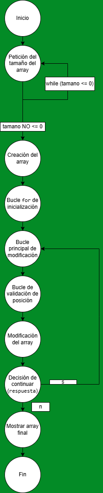

## 1. Comprobación de ejecución del código 

¿El código se ejecuta correctamente?

✔ Sí, el código compila y se ejecuta correctamente.

Observaciones:

El Scanner está bien utilizado.

Los bucles while (true) tienen condiciones de salida claras (break).

No hay accesos fuera de los límites del array.

Se ha corregido correctamente el error típico de permitir posicion == tamano.

El programa finaliza de forma limpia y muestra el array final.

-- No es necesario corregir el código, ya cumple funcionalmente con su objetivo. --

## 2. 2. Pruebas del camino básico 

### 2.1 --- Grafo de flujo del método ---



### 2.2 --- Complejidad ciclomática ---

```
Conteo de decisiones
Estructura	                                    Cuenta
while (true) → tamaño	                           1
if (tamano > 0)	                                   1
for (i < tamano)	                               1
while (true) → modificar	                       1
while (true) → posición	                           1
if (posicion > 0 && posicion <= tamano)	           2
if (respuesta.equalsIgnoreCase("n"))	           1
Total decisiones (D)	                           8
𝑀 = 8 + 1 = 9
```

#### ¿Cumple el estándar de la empresa?

❌ No cumple estrictamente, ya que la empresa exige una complejidad menor que 9, y el valor es 9 exacto.

#### ¿Es un código fácil de mantener?

```
🟡 Mantenibilidad media

Puntos positivos:

Código claro y bien comentado.

Validaciones correctas.

Fácil de entender para principiantes.

Puntos negativos:

Demasiados while (true) con break.

Toda la lógica está concentrada en main.

Difícil de testear automáticamente.

Cambios sugeridos para cumplir el estándar

✔️ Extraer lógica en métodos:

pedirTamanoArray()

pedirPosicionValida()

mostrarArray()

✔️ Sustituir while (true) por condiciones explícitas
✔️ Reducir decisiones en main

Con estos cambios, la complejidad ciclomática de main bajaría a < 6, cumpliendo el estándar de la empresa.
```


### 2.3 --- Conjunto básico de caminos independientes ---

```
Número de caminos independientes = 9

Ejemplos de caminos básicos:

Tamaño válido a la primera, modificar una vez y salir

Tamaño inválido → válido → modificar → salir

Tamaño válido → posición inválida → válida → salir

Tamaño válido → modificar varias veces → salir

Tamaño válido → respuesta distinta de n → repetir

Posición límite inferior (1)

Posición límite superior (tamano)

Respuesta "N"

Respuesta "n"
```

### 2.4 --- Casos de prueba ---

|Caso | Tamaño | Posición |Valor | Respuesta | Resultado esperado |
| ----| ------ | -------- | ---- | --------- | ------------------ | 
|1 | 5 | 1 | 99 | n | Modifica primera posición |
|2 | 5 | 5 | 10 | n | Modifica última posición |
|3 | 5 | 0 | — | — | Error de posición |
|4 | 5 | 6 | — | — | Error de posición |
|5 | -1 | — | — | — | Repite petición |
|6 | 3 | 2 | 7 | s | Continúa modificando |
|7 | 3 | 2 | 7 | N | Sale del bucle |


## 3. Particiones de equivalencia (con valores límite)

```
Tamaño del array (tamano)

Válidos: tamano > 0

Inválidos: tamano ≤ 0

Valores límite

0 ❌

1 ✅

Posición (posicion)

Válidos: 1 ≤ posicion ≤ tamano

Inválidos: posicion ≤ 0, posicion > tamano

Valores límite

0 ❌

1 ✅

tamano ✅

tamano + 1 ❌

Respuesta (respuesta)

Salir: "n", "N"

Continuar: cualquier otro valor ("s", "S", "x", etc.)
```

## [>>Vovler a listado de ejercicios<<](../README.md)